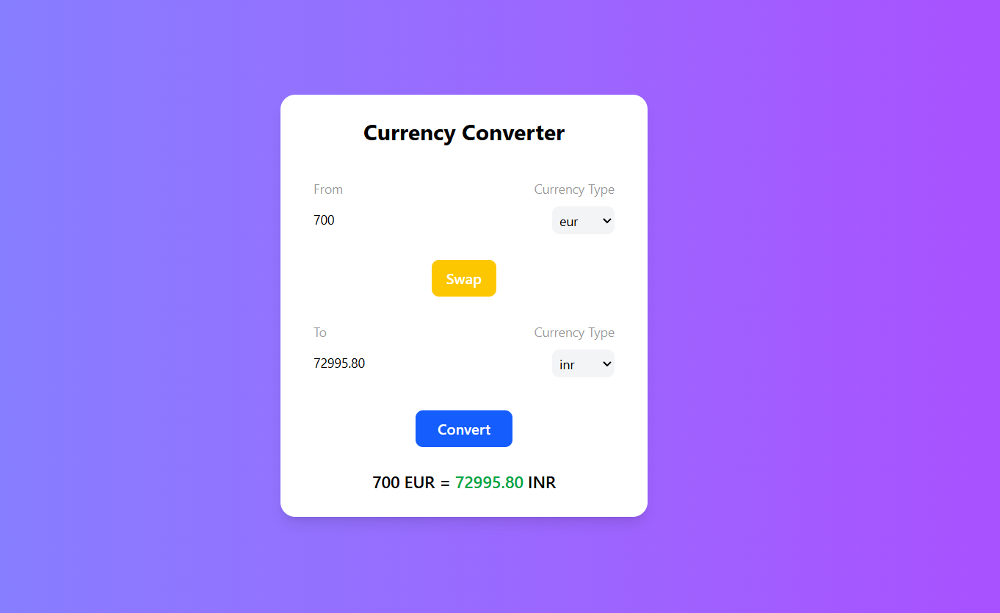

# 💱 Currency Converter App

A **React-based currency converter** that lets you convert between **any two currencies** using real-time exchange rates.

## 🚀 Features
- Convert **any currency** to any other currency 🌍
- Real-time rates with API integration 💹
- Clean and responsive UI ✨
- Built with **React + Vite**

## ⚙️ Tech Stack
- React
- Vite
- Custom Hooks
- CSS / Tailwind (if used)

## 🧾 How to Run Locally
1. **Clone the repository**
```bash
git clone https://github.com/YOUR_USERNAME/currency-converter-app.git
```




